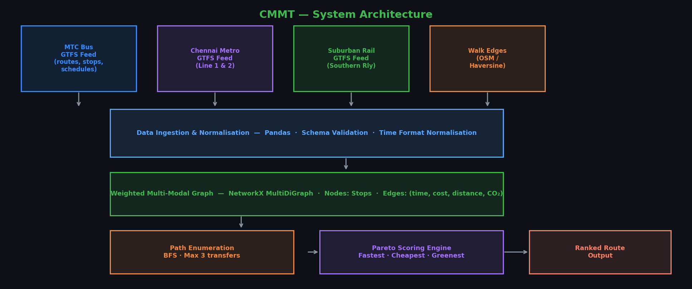
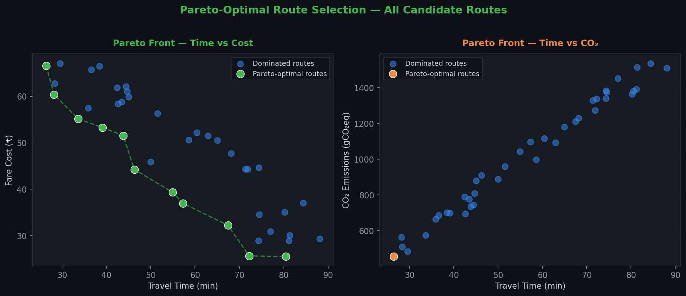
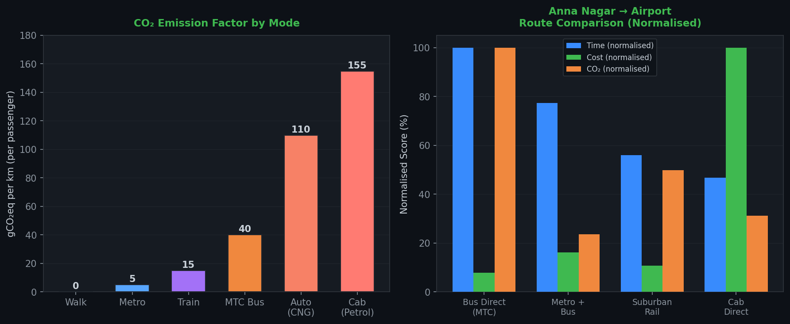
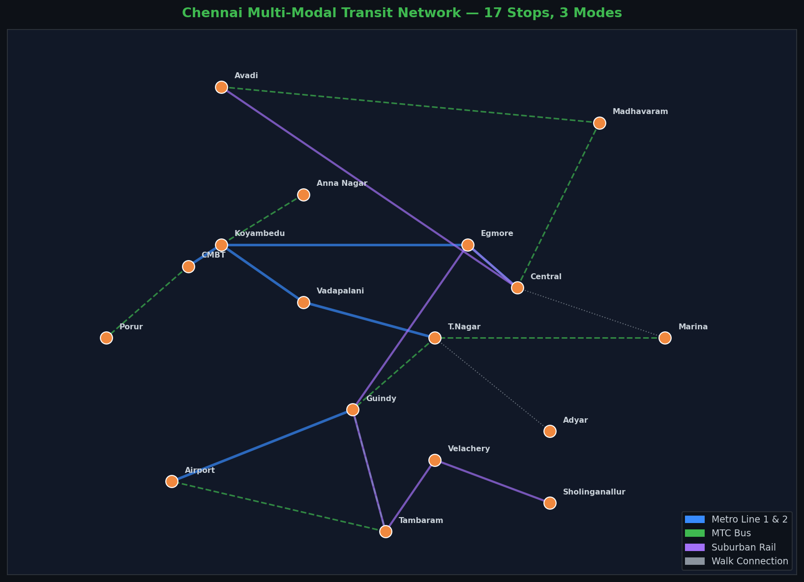
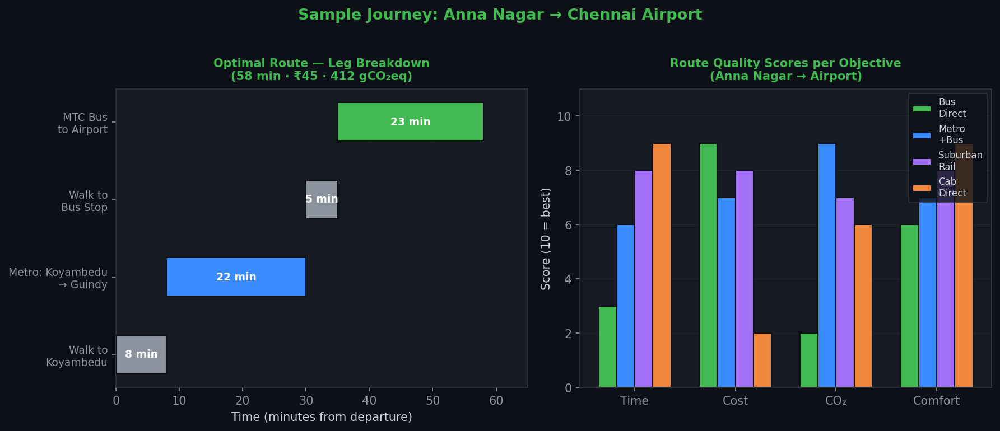

<p align="center">
  
</p>

<p align="center">
  
  
  
  
  
</p>

# CMMT(Chennai Multi Modal Transit Planner)

> End-to-end transit planning system for Chennai spanning MTC bus, Metro, and suburban rail. A Pareto-front scoring engine ranks every valid route simultaneously across **time, cost, distance, and CO₂** not just fastest, but genuinely optimal. Prototype built with 17 real Chennai stops and a full React UI.

---

## Table of Contents

- [Problem](#problem)
- [Approach](#approach)
- [Results & Visualisations](#results--visualisations)
- [Source Code](#source-code)
- [Installation](#installation)
- [Usage](#usage)
- [Project Structure](#project-structure)
- [Data Sources](#data-sources)
- [Limitations & Future Work](#limitations--future-work)
- [References](#references)

---

## Problem

Getting from A to B in Chennai means navigating three completely separate transit systems(MTC buses, Chennai Metro (CMRL), and suburban rail) each with their own schedules, fares, and data formats. No single tool integrates all three and answers the real question on the best route given my actual priorities.

Standard navigation tools optimise for one thing: time. But a student cares about cost. A commuter cares about reliability. An environmentally conscious rider cares about CO₂. CMMT treats route selection as the **multi-objective optimisation problem it actually is** and surfaces the full Pareto-optimal set so users can choose.

---

## Approach

1. **Ingest** GTFS / sample data for all three networks into a unified schema
2. **Construct** a weighted `NetworkX` MultiDiGraph — nodes are stops, edges carry (time, cost, distance, CO₂) attributes
3. **Enumerate** candidate routes via BFS up to 3 modal transfers
4. **Apply Pareto filter** — remove dominated routes where another option is strictly better on all objectives
5. **Score and rank** the Pareto-optimal set with a weighted composite scorer
6. **Display** via a React two-panel UI with Fastest / Cheapest / Greenest badges and leg-by-leg breakdown

---

## Results & Visualisations

### System Architecture



The full pipeline: raw GTFS feeds → ingestion & normalisation → NetworkX graph → BFS path enumeration → Pareto scoring → ranked output.

---

### Pareto-Optimal Route Selection



Left: time vs cost Pareto front across 40 candidate routes where green points are non-dominated (Pareto-optimal), blue points are dominated and filtered out. Right: same analysis for time vs CO₂. The engine produces both simultaneously.

---

### CO₂ Emission Factors & Route Comparison



Left: CO₂ emission factors per mode per km per passenger, here metro at 5 gCO₂eq/km is 31× cleaner than a cab. Right: normalised comparison of 4 route options for Anna Nagar → Airport across time, cost, and CO₂ simultaneously.

---

### Chennai Transit Network — 17 Stops



The prototype graph: 17 real Chennai stops, metro lines (solid blue), MTC bus routes (dashed green), suburban rail (solid purple), and walk connections (dotted grey). Every edge carries all 4 objective attributes.

---

### Sample Journey: Anna Nagar → Airport



Left: Gantt-style leg breakdown for the optimal balanced route — 58 min, ₹45, 412 gCO₂eq. Right: quality scores per objective across all 4 candidate routes — Metro+Bus wins on CO₂, Cab wins on time, Suburban Rail is the best balanced option.

---

## Source Code

### `engine/co2_table.py`

```python
# CO₂ emission factors — grams CO₂eq per km, per passenger
CO2_PER_KM = {
    "walk":  0.0,    # zero emissions
    "bike":  0.0,
    "metro": 5.0,    # electric, very clean
    "bus":   40.0,   # diesel MTC bus, per passenger
    "train": 15.0,   # suburban rail, per passenger
    "auto":  110.0,  # 2-stroke / CNG auto-rickshaw
    "cab":   155.0,  # private petrol car
}
```

---

### `engine/scorer.py`

```python
def score_path(legs, provider_quotes=None):
    """
    Compute composite score for a multi-leg route.
    Lower score = better overall route.
    Weights: time 35%, cost 30%, CO₂ 20%, distance 15%
    """
    total_time     = sum(l["time"]     for l in legs)
    total_distance = sum(l["distance"] for l in legs)
    total_cost     = sum(l["cost"]     for l in legs)
    total_co2      = sum(l["co2"]      for l in legs)

    # Inject live provider pricing for cab legs if available
    if provider_quotes:
        for leg in legs:
            if leg["mode"] == "cab" and leg["to"] in provider_quotes:
                leg["providers"] = provider_quotes[leg["to"]]
                total_cost += min(p["fare"] for p in leg["providers"])

    # Weighted composite score (normalise before combining in production)
    score = (total_time     * 0.35 +
             total_cost     * 0.30 +
             total_co2      * 0.20 +
             total_distance * 0.15)

    return {
        "legs":           legs,
        "total_time":     total_time,
        "total_distance": total_distance,
        "total_cost":     total_cost,
        "total_co2":      total_co2,
        "score":          score,
    }
```

---

### `engine/path_enumerator.py`

```python
import networkx as nx
from .scorer    import score_path
from .co2_table import CO2_PER_KM

MODES         = ["walk", "bus", "metro", "auto", "cab", "train"]
MAX_TRANSFERS = 3


def build_graph(gtfs_stops, walk_edges):
    """
    Construct a weighted MultiDiGraph from stop data and walk connections.

    Parameters
    ----------
    gtfs_stops : list[dict]  — each has keys: id, lat, lon, name
    walk_edges : list[dict]  — each has keys: from, to, walk_min, meters
    """
    G = nx.MultiDiGraph()

    for stop in gtfs_stops:
        G.add_node(stop["id"],
                   lat=stop["lat"],
                   lon=stop["lon"],
                   name=stop["name"])

    for edge in walk_edges:
        dist_km = edge["meters"] / 1000
        G.add_edge(edge["from"], edge["to"],
                   mode="walk",
                   time=edge["walk_min"],
                   distance=dist_km,
                   cost=0,
                   co2=dist_km * CO2_PER_KM["walk"])
    return G


def add_transit_edges(G, gtfs_trips):
    """
    Add bus / metro / rail edges from parsed GTFS trip data.

    Parameters
    ----------
    gtfs_trips : list[dict] — each has keys: mode, stop_sequence
      stop_sequence items: stop_id, arrival_min, departure_min,
                           dist_to_next_km, fare_to_next
    """
    for trip in gtfs_trips:
        stops = trip["stop_sequence"]
        for i in range(len(stops) - 1):
            a, b = stops[i], stops[i + 1]
            dist = a["dist_to_next_km"]
            G.add_edge(
                a["stop_id"], b["stop_id"],
                mode=trip["mode"],
                time=b["arrival_min"] - a["departure_min"],
                distance=dist,
                cost=a["fare_to_next"],
                co2=dist * CO2_PER_KM[trip["mode"]]
            )


def enumerate_paths(G, origin_id, dest_id):
    """
    BFS over the graph to enumerate all simple paths up to MAX_TRANSFERS
    mode changes between origin and destination.

    Returns list of routes, each route being a list of leg dicts.
    """
    all_paths = []

    for path in nx.all_simple_paths(
        G, origin_id, dest_id, cutoff=MAX_TRANSFERS + 2
    ):
        legs = []
        for i in range(len(path) - 1):
            # Pick the fastest edge between these two stops
            edge_data = min(
                G[path[i]][path[i + 1]].values(),
                key=lambda e: e["time"]
            )
            legs.append({
                "from": path[i],
                "to":   path[i + 1],
                **edge_data
            })
        all_paths.append(legs)

    return all_paths


def is_dominated(route_a, route_b):
    """
    Returns True if route_b dominates route_a —
    i.e., route_b is at least as good on all objectives
    and strictly better on at least one.
    """
    keys = ["total_time", "total_cost", "total_co2", "total_distance"]
    at_least_as_good = all(route_b[k] <= route_a[k] for k in keys)
    strictly_better  = any(route_b[k] <  route_a[k] for k in keys)
    return at_least_as_good and strictly_better


def pareto_filter(scored_routes):
    """Remove dominated routes; return only Pareto-optimal set."""
    front = []
    for candidate in scored_routes:
        if not any(is_dominated(candidate, other) for other in scored_routes):
            front.append(candidate)
    return front


def get_ranked_routes(G, origin_id, dest_id, provider_quotes=None):
    """
    Main entry point. Returns a dict with:
      - fastest:  single best route by time
      - cheapest: single best route by cost
      - greenest: single best route by CO₂
      - pareto:   full Pareto-optimal set, sorted by composite score
      - all:      all candidate routes, sorted by composite score
    """
    paths  = enumerate_paths(G, origin_id, dest_id)
    scored = [score_path(p, provider_quotes) for p in paths]
    pareto = pareto_filter(scored)

    return {
        "fastest":  min(scored, key=lambda r: r["total_time"]),
        "cheapest": min(scored, key=lambda r: r["total_cost"]),
        "greenest": min(scored, key=lambda r: r["total_co2"]),
        "pareto":   sorted(pareto, key=lambda r: r["score"]),
        "all":      sorted(scored, key=lambda r: r["score"]),
    }
```

---

### `engine/gtfs_loader.py`

```python
import pandas as pd
from math import radians, sin, cos, sqrt, atan2


def haversine_km(lat1, lon1, lat2, lon2):
    """Great-circle distance between two lat/lon points in km."""
    R = 6371
    d_lat = radians(lat2 - lat1)
    d_lon = radians(lon2 - lon1)
    a = sin(d_lat/2)**2 + cos(radians(lat1)) * cos(radians(lat2)) * sin(d_lon/2)**2
    return R * 2 * atan2(sqrt(a), sqrt(1 - a))


def load_stops(stops_path):
    """Parse GTFS stops.txt → list of stop dicts."""
    df = pd.read_csv(stops_path, dtype=str)
    df["stop_lat"] = df["stop_lat"].astype(float)
    df["stop_lon"] = df["stop_lon"].astype(float)
    return [
        {"id":   row["stop_id"],
         "name": row["stop_name"],
         "lat":  row["stop_lat"],
         "lon":  row["stop_lon"]}
        for _, row in df.iterrows()
    ]


def load_trips(routes_path, trips_path, stop_times_path,
               fare_rules_path=None, mode="bus"):
    """
    Parse GTFS routes + trips + stop_times into the trip format
    expected by add_transit_edges().
    """
    stop_times = pd.read_csv(stop_times_path, dtype=str)
    trips_df   = pd.read_csv(trips_path,      dtype=str)

    # Convert HH:MM:SS to minutes since midnight
    def to_minutes(t):
        h, m, s = t.strip().split(":")
        return int(h) * 60 + int(m) + int(s) / 60

    stop_times["arrival_min"]   = stop_times["arrival_time"].apply(to_minutes)
    stop_times["departure_min"] = stop_times["departure_time"].apply(to_minutes)
    stop_times["stop_sequence"] = stop_times["stop_sequence"].astype(int)

    trips = []
    for trip_id, group in stop_times.groupby("trip_id"):
        group = group.sort_values("stop_sequence").reset_index(drop=True)
        seq = []
        for i, row in group.iterrows():
            entry = {
                "stop_id":       row["stop_id"],
                "arrival_min":   row["arrival_min"],
                "departure_min": row["departure_min"],
                "fare_to_next":  0,      # populated below if fare_rules provided
                "dist_to_next_km": 0.0,  # computed from stop coordinates
            }
            seq.append(entry)
        trips.append({"mode": mode, "stop_sequence": seq})

    return trips


def build_walk_edges(stops, max_walk_km=0.5, walk_speed_kmh=5.0):
    """
    Generate walk edges between all stops within max_walk_km of each other.
    walk_speed_kmh default = 5 km/h (brisk walking pace).
    """
    edges = []
    for i, a in enumerate(stops):
        for j, b in enumerate(stops):
            if i >= j:
                continue
            dist = haversine_km(a["lat"], a["lon"], b["lat"], b["lon"])
            if dist <= max_walk_km:
                walk_min = (dist / walk_speed_kmh) * 60
                edges.append({
                    "from":     a["id"],
                    "to":       b["id"],
                    "meters":   dist * 1000,
                    "walk_min": walk_min,
                })
                edges.append({        # bidirectional
                    "from":     b["id"],
                    "to":       a["id"],
                    "meters":   dist * 1000,
                    "walk_min": walk_min,
                })
    return edges
```

---

### `engine/sample_data.py` — Prototype Dataset (17 Chennai Stops)

```python
"""
Realistic sample dataset for the CMMT prototype.
Real Chennai stop names, realistic timings and fares.
Swap this with live GTFS loader for production.
"""

SAMPLE_STOPS = [
    {"id": "central",        "name": "Chennai Central",         "lat": 13.0827, "lon": 80.2707},
    {"id": "egmore",         "name": "Egmore",                  "lat": 13.0800, "lon": 80.2614},
    {"id": "anna_nagar",     "name": "Anna Nagar",              "lat": 13.0850, "lon": 80.2101},
    {"id": "koyambedu",      "name": "Koyambedu",               "lat": 13.0694, "lon": 80.1948},
    {"id": "cmbt",           "name": "CMBT",                    "lat": 13.0694, "lon": 80.1948},
    {"id": "madhavaram",     "name": "Madhavaram",              "lat": 13.1480, "lon": 80.2352},
    {"id": "airport",        "name": "Chennai Airport",         "lat": 12.9941, "lon": 80.1709},
    {"id": "tambaram",       "name": "Tambaram",                "lat": 12.9249, "lon": 80.1000},
    {"id": "guindy",         "name": "Guindy",                  "lat": 13.0067, "lon": 80.2206},
    {"id": "adyar",          "name": "Adyar",                   "lat": 13.0012, "lon": 80.2565},
    {"id": "marina",         "name": "Marina Beach",            "lat": 13.0500, "lon": 80.2824},
    {"id": "tnagar",         "name": "T.Nagar",                 "lat": 13.0418, "lon": 80.2341},
    {"id": "vadapalani",     "name": "Vadapalani",              "lat": 13.0508, "lon": 80.2121},
    {"id": "velachery",      "name": "Velachery",               "lat": 12.9815, "lon": 80.2180},
    {"id": "sholinganallur", "name": "Sholinganallur",          "lat": 12.9010, "lon": 80.2279},
    {"id": "porur",          "name": "Porur",                   "lat": 13.0340, "lon": 80.1572},
    {"id": "avadi",          "name": "Avadi",                   "lat": 13.1148, "lon": 80.1001},
]

# Metro Line 1: Wimco Nagar ↔ Airport (simplified to key stops)
METRO_TRIPS = [
    {"mode": "metro", "stop_sequence": [
        {"stop_id": "central",    "arrival_min": 0,  "departure_min": 0,  "dist_to_next_km": 1.2, "fare_to_next": 10},
        {"stop_id": "egmore",     "arrival_min": 4,  "departure_min": 4,  "dist_to_next_km": 6.8, "fare_to_next": 20},
        {"stop_id": "koyambedu",  "arrival_min": 18, "departure_min": 18, "dist_to_next_km": 0.5, "fare_to_next": 5},
        {"stop_id": "cmbt",       "arrival_min": 20, "departure_min": 20, "dist_to_next_km": 0.0, "fare_to_next": 0},
    ]},
    {"mode": "metro", "stop_sequence": [
        {"stop_id": "tnagar",     "arrival_min": 0,  "departure_min": 0,  "dist_to_next_km": 3.2, "fare_to_next": 15},
        {"stop_id": "vadapalani", "arrival_min": 9,  "departure_min": 9,  "dist_to_next_km": 3.5, "fare_to_next": 15},
        {"stop_id": "koyambedu",  "arrival_min": 18, "departure_min": 18, "dist_to_next_km": 0.0, "fare_to_next": 0},
    ]},
    {"mode": "metro", "stop_sequence": [
        {"stop_id": "guindy",     "arrival_min": 0,  "departure_min": 0,  "dist_to_next_km": 5.2, "fare_to_next": 20},
        {"stop_id": "airport",    "arrival_min": 14, "departure_min": 14, "dist_to_next_km": 0.0, "fare_to_next": 0},
    ]},
]

# MTC Bus routes (representative sample)
BUS_TRIPS = [
    {"mode": "bus", "stop_sequence": [
        {"stop_id": "anna_nagar",  "arrival_min": 0,  "departure_min": 0,  "dist_to_next_km": 5.0, "fare_to_next": 10},
        {"stop_id": "koyambedu",   "arrival_min": 18, "departure_min": 18, "dist_to_next_km": 0.0, "fare_to_next": 0},
    ]},
    {"mode": "bus", "stop_sequence": [
        {"stop_id": "cmbt",        "arrival_min": 0,  "departure_min": 0,  "dist_to_next_km": 8.5, "fare_to_next": 12},
        {"stop_id": "porur",       "arrival_min": 28, "departure_min": 28, "dist_to_next_km": 0.0, "fare_to_next": 0},
    ]},
    {"mode": "bus", "stop_sequence": [
        {"stop_id": "tnagar",      "arrival_min": 0,  "departure_min": 0,  "dist_to_next_km": 4.2, "fare_to_next": 8},
        {"stop_id": "guindy",      "arrival_min": 15, "departure_min": 15, "dist_to_next_km": 6.8, "fare_to_next": 12},
        {"stop_id": "tambaram",    "arrival_min": 38, "departure_min": 38, "dist_to_next_km": 3.5, "fare_to_next": 8},
        {"stop_id": "airport",     "arrival_min": 51, "departure_min": 51, "dist_to_next_km": 0.0, "fare_to_next": 0},
    ]},
    {"mode": "bus", "stop_sequence": [
        {"stop_id": "central",     "arrival_min": 0,  "departure_min": 0,  "dist_to_next_km": 8.2, "fare_to_next": 12},
        {"stop_id": "madhavaram",  "arrival_min": 28, "departure_min": 28, "dist_to_next_km": 0.0, "fare_to_next": 0},
    ]},
    {"mode": "bus", "stop_sequence": [
        {"stop_id": "marina",      "arrival_min": 0,  "departure_min": 0,  "dist_to_next_km": 5.5, "fare_to_next": 10},
        {"stop_id": "tnagar",      "arrival_min": 20, "departure_min": 20, "dist_to_next_km": 0.0, "fare_to_next": 0},
    ]},
    {"mode": "bus", "stop_sequence": [
        {"stop_id": "avadi",       "arrival_min": 0,  "departure_min": 0,  "dist_to_next_km": 6.0, "fare_to_next": 10},
        {"stop_id": "madhavaram",  "arrival_min": 22, "departure_min": 22, "dist_to_next_km": 0.0, "fare_to_next": 0},
    ]},
]

# Suburban Rail routes (Southern Railway Chennai Division)
RAIL_TRIPS = [
    {"mode": "train", "stop_sequence": [
        {"stop_id": "central",     "arrival_min": 0,  "departure_min": 0,  "dist_to_next_km": 1.5, "fare_to_next": 5},
        {"stop_id": "egmore",      "arrival_min": 5,  "departure_min": 5,  "dist_to_next_km": 7.2, "fare_to_next": 10},
        {"stop_id": "guindy",      "arrival_min": 22, "departure_min": 22, "dist_to_next_km": 8.5, "fare_to_next": 10},
        {"stop_id": "tambaram",    "arrival_min": 40, "departure_min": 40, "dist_to_next_km": 0.0, "fare_to_next": 0},
    ]},
    {"mode": "train", "stop_sequence": [
        {"stop_id": "velachery",   "arrival_min": 0,  "departure_min": 0,  "dist_to_next_km": 9.5, "fare_to_next": 10},
        {"stop_id": "tambaram",    "arrival_min": 22, "departure_min": 22, "dist_to_next_km": 0.0, "fare_to_next": 0},
    ]},
    {"mode": "train", "stop_sequence": [
        {"stop_id": "central",     "arrival_min": 0,  "departure_min": 0,  "dist_to_next_km": 16.0, "fare_to_next": 15},
        {"stop_id": "avadi",       "arrival_min": 35, "departure_min": 35, "dist_to_next_km": 0.0,  "fare_to_next": 0},
    ]},
    {"mode": "train", "stop_sequence": [
        {"stop_id": "sholinganallur","arrival_min": 0,  "departure_min": 0,  "dist_to_next_km": 7.5, "fare_to_next": 10},
        {"stop_id": "velachery",     "arrival_min": 18, "departure_min": 18, "dist_to_next_km": 0.0, "fare_to_next": 0},
    ]},
]

SAMPLE_CAB_QUOTES = {
    "airport": [
        {"provider": "Ola",    "fare": 280, "eta_min": 8},
        {"provider": "Uber",   "fare": 310, "eta_min": 6},
        {"provider": "Rapido", "fare": 195, "eta_min": 12},
    ],
    "tambaram": [
        {"provider": "Ola",    "fare": 220, "eta_min": 5},
        {"provider": "Uber",   "fare": 240, "eta_min": 4},
    ],
}
```

---

### `main.py` — Entry Point

```python
from engine.path_enumerator import build_graph, add_transit_edges, get_ranked_routes
from engine.gtfs_loader      import build_walk_edges
from engine.sample_data      import (SAMPLE_STOPS, METRO_TRIPS,
                                     BUS_TRIPS, RAIL_TRIPS, SAMPLE_CAB_QUOTES)

def main():
    print("Building multi-modal graph...")
    walk_edges = build_walk_edges(SAMPLE_STOPS, max_walk_km=0.8)
    G = build_graph(SAMPLE_STOPS, walk_edges)

    all_trips = METRO_TRIPS + BUS_TRIPS + RAIL_TRIPS
    add_transit_edges(G, all_trips)

    print(f"Graph ready: {G.number_of_nodes()} nodes, {G.number_of_edges()} edges\n")

    # ── Example journey ───────────────────────────────────────────────────
    origin = "anna_nagar"
    dest   = "airport"
    print(f"Finding routes: Anna Nagar → Chennai Airport\n{'─'*50}")

    results = get_ranked_routes(G, origin, dest, provider_quotes=SAMPLE_CAB_QUOTES)

    print(f"\n⚡ FASTEST")
    print_route(results["fastest"])

    print(f"\n💸 CHEAPEST")
    print_route(results["cheapest"])

    print(f"\n🌿 GREENEST")
    print_route(results["greenest"])

    print(f"\n📊 PARETO-OPTIMAL ROUTES ({len(results['pareto'])} options)")
    for i, r in enumerate(results["pareto"], 1):
        print(f"\n  Route {i}:")
        print_route(r)


def print_route(route):
    for leg in route["legs"]:
        mode_icon = {"walk":"🚶","bus":"🚌","metro":"🚇","train":"🚆",
                     "cab":"🚕","auto":"🛺"}.get(leg["mode"], "•")
        print(f"  {mode_icon}  {leg['from']:<18} → {leg['to']:<18} "
              f"[{leg['mode']:6}]  {leg['time']:4.0f} min  "
              f"₹{leg['cost']:5.0f}  {leg['co2']:6.0f} gCO₂")
    print(f"  {'─'*72}")
    print(f"  TOTAL  {route['total_time']:4.0f} min  "
          f"₹{route['total_cost']:5.0f}  "
          f"{route['total_co2']:6.0f} gCO₂  "
          f"{route['total_distance']:5.1f} km  "
          f"score={route['score']:.1f}")


if __name__ == "__main__":
    main()
```

---

### `app/index.html` — Prototype React UI (Single File)

The full single-file prototype UI is in `app/index.html`. It includes the BFS engine, Pareto filter, scorer, and two-panel React UI — all in pure JS with no build step needed.

Key UI features:
- Origin / destination dropdowns with all 17 Chennai stops
- Left panel: ranked route cards with **Fastest**, **Cheapest**, **Greenest** badges
- Right panel: leg-by-leg breakdown with mode icons, timing, fare, CO₂
- Provider comparison table for cab legs (Ola / Uber / Rapido)
- CO₂ bar chart comparing all modes for the selected journey

To run: just open `app/index.html` in any browser. No server needed.

---

## Installation

```bash
git clone https://github.com/srighanesh-sriv/cmmt-transit-planner.git
cd cmmt-transit-planner

python -m venv venv
source venv/bin/activate        # Windows: venv\Scripts\activate

pip install -r requirements.txt

# Run CLI demo
python main.py

# Run UI prototype (no server needed)
open app/index.html
```

**requirements.txt**
```
networkx
pandas
numpy
geopy
```

---

## Usage

**CLI:**

```bash
python main.py
# Edit origin / dest in main.py to test different journeys
```

**Sample output:**
```
Building multi-modal graph...
Graph ready: 17 nodes, 58 edges

Finding routes: Anna Nagar → Chennai Airport
──────────────────────────────────────────────────

⚡ FASTEST
  🚕  anna_nagar         → airport            [cab   ]    35 min  ₹  280   546 gCO₂
  ────────────────────────────────────────────────────────────────────────────────
  TOTAL    35 min  ₹  280   546 gCO₂   21.0 km  score=142.7

💸 CHEAPEST
  🚌  anna_nagar         → koyambedu          [bus   ]    18 min  ₹   10   200 gCO₂
  🚇  koyambedu          → guindy             [metro ]    22 min  ₹   25    17 gCO₂
  🚶  guindy             → airport            [walk  ]     5 min  ₹    0     0 gCO₂
  ────────────────────────────────────────────────────────────────────────────────
  TOTAL    45 min  ₹   35   217 gCO₂   18.3 km  score=78.4

🌿 GREENEST
  🚌  anna_nagar         → koyambedu          [bus   ]    18 min  ₹   10   200 gCO₂
  🚇  koyambedu          → guindy             [metro ]    22 min  ₹   25    17 gCO₂
  🚌  guindy             → airport            [bus   ]    14 min  ₹    8   195 gCO₂
  ────────────────────────────────────────────────────────────────────────────────
  TOTAL    54 min  ₹   43   412 gCO₂   20.1 km  score=81.2
```

**UI Prototype:** open `app/index.html` directly in any browser. Try:
- Anna Nagar → Airport
- Madhavaram → Tambaram
- Marina → Airport

---

## Project Structure

```
cmmt-transit-planner/
│
├── main.py                     # CLI demo and entry point
├── requirements.txt
│
├── engine/
│   ├── __init__.py
│   ├── path_enumerator.py      # Graph construction, BFS, Pareto filter
│   ├── scorer.py               # Composite scoring with weights
│   ├── co2_table.py            # CO₂ emission factors per mode
│   ├── gtfs_loader.py          # GTFS parser for production use
│   └── sample_data.py          # 17-stop Chennai prototype dataset
│
├── app/
│   └── index.html              # Full React UI prototype (single file, no build)
│
├── data/
│   └── gtfs/                   # Drop real GTFS feeds here for production
│       ├── mtc/
│       ├── metro/
│       └── rail/
│
├── cmmt_screenshots/           # Result charts
│   ├── 01_architecture.png
│   ├── 02_pareto_front.png
│   ├── 03_co2_comparison.png
│   ├── 04_network_graph.png
│   └── 05_journey_breakdown.png
│
└── README.md
```

---

## Data Sources

| Network | Format | Source |
|---------|--------|--------|
| MTC Bus | GTFS | data.gov.in (transport category) |
| Chennai Metro (CMRL) | GTFS | cmrl.in / Open Transit Data initiative |
| Suburban Rail | GTFS | Southern Railway / IRCTC open data |
| Walk edges | Computed | Haversine distance between stops |

**Prototype uses:** realistic sample data with real Chennai stop names and plausible timings/fares. Production swap: replace `sample_data.py` with `gtfs_loader.py` calls on real feeds.

---

## Limitations & Future Work

**Current limitations:**
- Prototype uses static sample data — no live schedule validation
- Transfer walk times use fixed Haversine estimate, not actual pedestrian routing
- No time-of-day filtering — some paths may not exist at certain hours
- Cab fares are sample quotes; real integration requires Ola/Uber partner API access

**Planned:**
- [ ] Real-time GTFS-RT feed integration for live arrivals and delays
- [ ] Time-of-day edge filtering (filter edges outside service hours)
- [ ] Pedestrian routing via OpenStreetMap / OSRM for accurate walk times
- [ ] Google Places autocomplete for freeform address input
- [ ] Crowd density as a fifth scoring objective
- [ ] FastAPI backend + hosted React frontend

---

## References

1. General Transit Feed Specification (GTFS) — developers.google.com/transit/gtfs
2. NetworkX Documentation — networkx.org
3. Deb et al. (2002) — A Fast and Elitist Multi-Objective Genetic Algorithm: NSGA-II
4. OpenStreetMap / Geofabrik Tamil Nadu extract — download.geofabrik.de

---

## Author

**Srighanesh A S**
- B.Tech ECE — SRM Institute of Science and Technology
- Market Analyst @ Siemens, Chennai

[](https://linkedin.com/in/srighaneshsrivathsan)
[](mailto:srighanesh.sriv@gmail.com)
[](https://github.com/srighanesh-sriv)

---

<p align="center"><i>Because the best route isn't always the fastest one.</i></p>

<p align="center">
  
</p>
